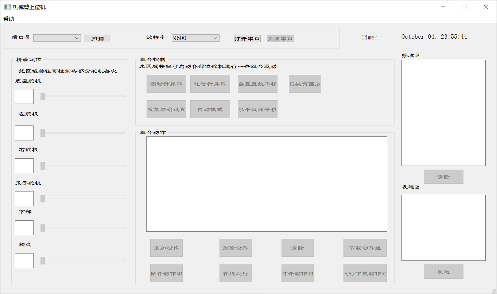
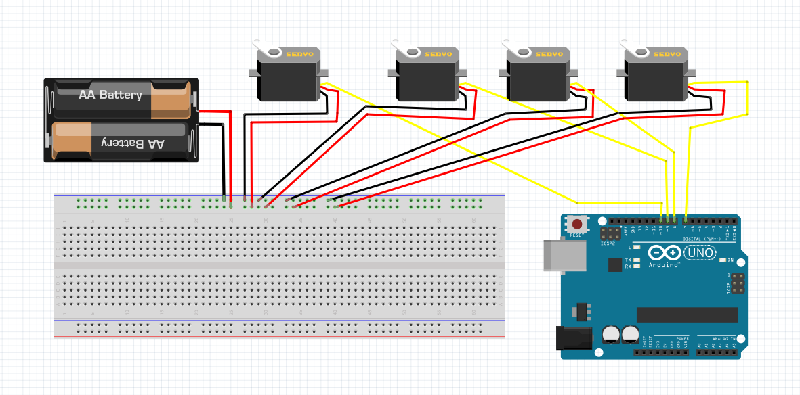
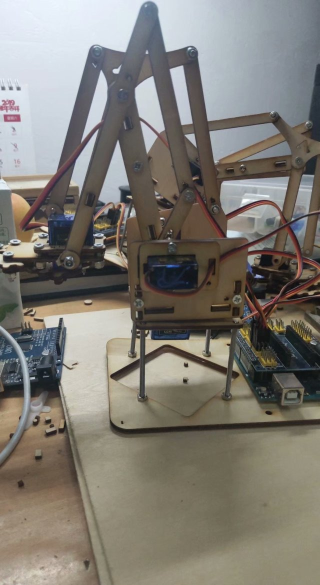

# PyQt_Arduino

#### 介绍
用PyQt5制作的一个上位机软件，用来控制一个Arduino四自由度机械臂。当然，为了扩展的需要，界面是按照六自由度机械臂制作的。

#### 开发环境

**系统：** windows10

**处理器:** Intel(R) Core(TM)i7-8550U CPU @ 1.8GHz  2.00GHz

**开发软件：** Pycharm 2017.1

**Python版本：** python3.7

**QT版本：** PyQt5

#### 使用说明

- 首先，上传好Arduino程序

#### 

舵机与Arduino的连线：

底座舵机 ----->   7

左舵机 -------->   8

右舵机 -------->   9

爪子舵机  ----->  10

这是我的机械臂：

在pycharm里运行上位机程序：

选择端口号和波特率，点击打开串口

拖动控制舵机角度

组合控制还没有做，下载动作组与运行下载动作组部分也没有做完。

源代码地址：https://gitee.com/tangbeida/PyQt_Arduino

